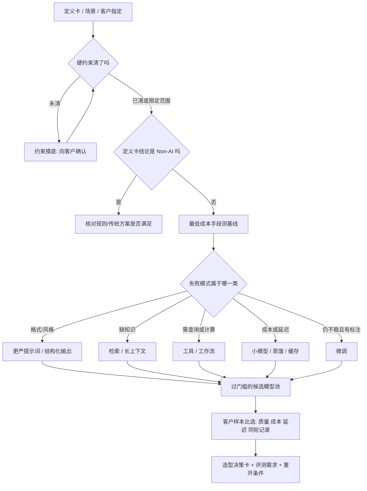

# 判断流程简图

顺序是先过滤、再选路线、后比模型；每一步都可能回退。图是工作流示意，不是机械闸门。

```mermaid
flowchart TD
  A[定义卡 / 场景 / 客户指定] --> B{硬约束清了吗}
  B -- 未清 --> B1[约束摸底: 向客户确认] --> B
  B -- 已清或限定范围 --> C{定义卡结论是 Non-AI 吗}
  C -- 是 --> C1[核对规则/传统方案是否满足]
  C -- 否 --> D[最低成本手段测基线]
  D --> E{失败模式属于哪一类}
  E -- 格式/风格 --> F1[更严提示词 / 结构化输出]
  E -- 缺知识 --> F2[检索 / 长上下文]
  E -- 需查询或计算 --> F3[工具 / 工作流]
  E -- 成本或延迟 --> F4[小模型 / 蒸馏 / 缓存]
  E -- 仍不稳且有标注 --> F5[微调]
  F1 --> G[过门槛的候选模型池]
  F2 --> G
  F3 --> G
  F4 --> G
  F5 --> G
  G --> H[客户样本比选: 质量 成本 延迟 同轮记录]
  H --> I[选型决策卡 + 评测需求 + 重开条件]
```

图后一句话：硬约束决定候选池，失败模式决定手段，客户样本上的实测决定模型；三者都要带日期和来源。
